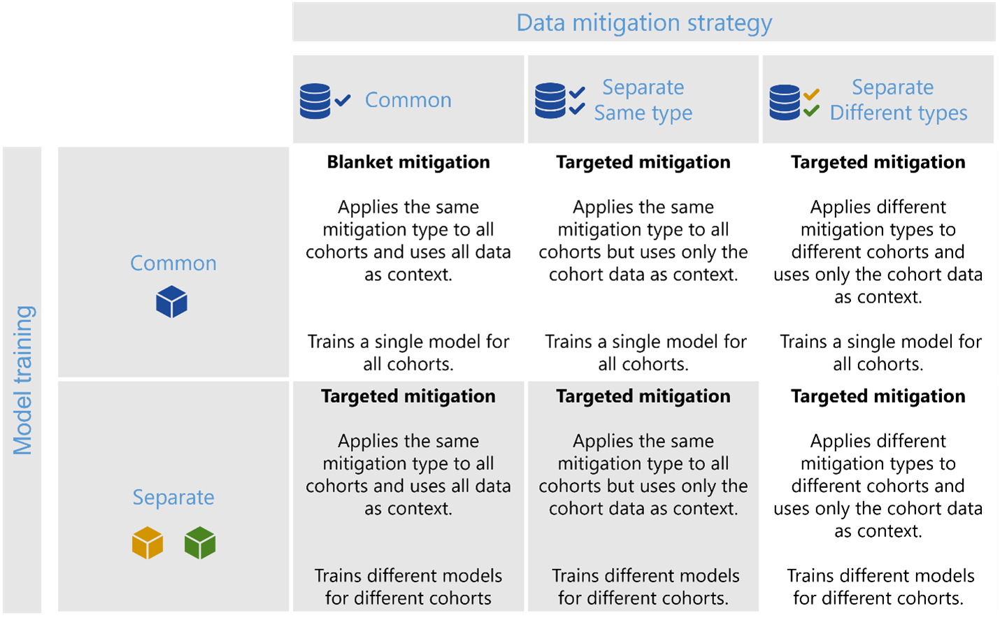

.. _decoupled_class:

DecoupledClass
==============

This class implements techniques for learning different estimators (models) for different cohorts based on the approach 
presented in `"Decoupled classifiers for group-fair and efficient machine learning." <https://www.microsoft.com/en-us/research/publication/decoupled-classifiers-for-group-fair-and-efficient-machine-learning/>`_  
Cynthia Dwork, Nicole Immorlica, Adam Tauman Kalai, and Max Leiserson. Conference on fairness, accountability and transparency. PMLR, 2018. The approach 
searches and combines cohort-specific classifiers to optimize for different definitions of group fairness and can be used 
as a post-processing step on top of any model class. The current implementation in this library supports only binary 
classification and we welcome contributions that can extend these ideas for multi-class and regression problems.

The basis decoupling algorithm can be summarized in two steps:

    * A different family of classifiers is trained on each cohort of interest. The algorithm partitions the training data 
      for each cohort and learns a classifier for each cohort. Each cohort-specific trained classifier results in a family 
      of potential classifiers to be used after the classifier output is adjusted based on different thresholds on the model 
      output. For example, depending on which errors are most important to the application (e.g. false positives vs. false 
      negatives for binary classification), thresholding the model prediction at different values of the model output (e.g. 
      likelihood, softmax) will result in different classifiers. This step generates a whole family of classifiers based on 
      different thresholds.
    * Among the cohort-specific classifiers search for one representative classifier for each cohort such that a joint loss 
      is optimized. This step searches through all combinations of classifiers from the previous step to find the combination 
      that best optimizes a definition of a joint loss across all cohorts. While there are different definitions of such a joint 
      loss, this implementation currently supports definitions of the Balanced Loss, L1 loss, and Demographic Parity as examples 
      of losses that focus on group fairness. More definitions of losses are described in the longer version of the paper.

One issue that arises commonly in cohort-specific learning is that some cohorts may also have little data in the training set, 
which may hinder the capability of a decoupled classifier to learn a better estimator for that cohort. To mitigate the problem, 
the DecoupledClassifier class also allows using transfer learning from the overall data for these cohorts. 

The figure below shows the types of scenarios that the DecoupledClassifier class can implement and how it compares to the CohortManager class. First, while the CohortManager class offers a general way to customize pipelines or train custom classifiers for cohorts, it does not offer any post-training capabilities for selecting classifiers such that they optimize a joint loss function for group fairness. In addition, transfer learning for minority cohorts is only available in the DecoupledClassifier class. To implement a scenario where the same type of data processing mitigation is applied to different cohorts separately, one can use the DecoupledClassifier with a transform pipeline (including the estimator).

  *Figure 1 - The DecoupledClassifier class can currently implement the highlighted scenarios in this figure, with additional functionalities in comparison to the CohortManager being i) joint optimization of a loss function for group fairness, and ii) transfer learning for minority cohorts.*

The tutorial notebook in addition to the decoupled classifiers case study notebooks demonstrate different scenarios where one can use this class.

.. autoclass:: raimitigations.cohort.DecoupledClass
   :members:

Examples
--------

.. nbgallery::
   ../notebooks/cohort/decoupled
   ../notebooks/cohort/case_study/decoupled_class/case_1
   ../notebooks/cohort/case_study/decoupled_class/case_2
   ../notebooks/cohort/case_study/decoupled_class/case_3