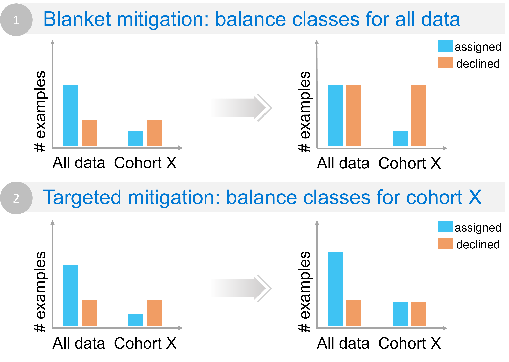

Responsible AI Mitigations Library
==================================

The goal of responsible AI is to create trustworthy AI systems that benefit people while mitigating harms, which can occur when AI systems fail to
perform with fair, reliable, or safe outputs for various stakeholders. Teams tasked with developing AI systems must work to identify, diagnose, and
mitigate potential harms as much as possible. In this initial release, **the Responsible AI Mitigations Library helps AI practitioners explore different
mitigation steps that may be most appropriate when the model underperforms for a given cohort.** The library currently has two modules:

    * :ref:`DataProcessing<dataproc>`: offers mitigation techniques for improving model performance for specific cohorts.
    * :ref:`DataBalanceAnalysis<databalance>`: provides metrics for diagnosing errors that originate from data imbalance either on class labels or feature values.

Exploring potential mitigations
-------------------------------

The Responsible AI Mitigations Library brings together in **one interface and compatible end-to-end data-processing pipelines** a series of well-known machine
learning techniques (based on popular implementations in scikit-learn, mlxtend, sdv, among others) that have been adapted to help AI practitioners **target
problems after they have identified model errors** using diagnostic tools such as those in the `Responsible AI Toolbox`_. :ref:`See more<integration_other_libs>`
about how this library works with the Responsible AI Toolbox.

.. _Responsible AI Toolbox: https://responsibleaitoolbox.ai/

.. figure:: imgs/diagnose_mitigate.png
  :scale: 18
  :alt: Diagnose and mitigate

  Figure 1 - The targeted approach to responsible AI mitigations focuses the mitigation process on previously identified and diagnosed failure modes.

After you've identified a model as underperforming for a specific cohort, the Responsible AI Mitigations Library can help inform your decisions for appropriate
mitigation. The library enables you to **explore potential mitigations for targeted cohorts and sub-cohorts** through:

    * Balancing and synthesizing data.
    * Selecting or creating features with different encodings with different encodings.
    * Scaling numerical features.
    * Imputing missing values.

**Note:** Although the Responsible AI Mitigations Library currently focuses on data problems, it will expand over time to include mitigations for model errors,
through customized loss functions, architectures, and new training algorithms.

.. _target_mitigation:

Benefits of targeted error mitigations
--------------------------------------

Traditional methods of improving model performance often take a blanket approach, aiming at maximizing a single-score performance number, such as overall accuracy.
Blanket approaches may involve increasing the size of training data or model architecture—approaches that are not only costly but also **ineffective** for improving the
model in areas of poorest performance.

  Figure 2 – Example of how blanket approaches may not help in mitigating the underlying issue for a given cohort (in this case flipped class imbalance).

Imagine the following example. A model that predicts customer credit reliability is underperforming for a given cohort X. When analyzing class balance for the data, it
becomes clear that overall there are more examples in the data for which a loan has been assigned. However, for the cohort of interest X, this distribution looks very
different with more examples of loans being declined. The discrepancy also leads to a higher error for this cohort as the model learns to over-decline. Merely adding
more data to adjust overall class imbalance (Scenario 1 in the figure) will not address class imbalance for cohort X. In fact, it might make it worse by accentuating
class imbalance for this cohort and declining more loans. A more targeted approach (Scenario 2 in the figure) would focus the class balance mitigation only on cohort X
by sampling or synthesizing more data within that cohort where loans have been assigned. The Responsible AI Mitigations library can implement the second
scenario using two approaches:

    1. Synthesizing data only for a given cohort (see the :ref:`dataprocessing.Synthesizer<syhtesizer>` class for more information);
    2. Use the :ref:`dataprocessing.Rebalance<rebalance>` together with the :ref:`cohort.CohortManager<cohort_manager>` in order to apply a over-sampling over only
       a set of cohorts (check the ``CohortManager``'s :ref:`Examples<cohort_manager_ex>` section to see how this can be achieved).

This way, the Responsible AI Mitigations Library offers a **targeted approach that lets you save time and resources by**:

    * **Testing your hypotheses for why a model is underperforming** in specific data cohorts through exploring data imbalance, features, label noise, or missing values.
    * **Improving your understanding of model failures** by zeroing in on:

        * A set of features in the dataset, allowing changing format or encoding only the features that are problematic.
        * A sub-cohort only, not touching any other data.

    * **Simplifying the implementation and customization of mitigations** for specific data problems by providing mitigations that are compatible with each other and can be
      combined into a single pipeline.

Two modules for targeting data
------------------------------

The Responsible AI Mitigations Library consists of **two modules that work in complement** for targeting and mitigating data problems: DataProcessing and DataBalanceAnalysis.

DataProcessing
##############

A set of data-oriented mitigation steps for data balancing, scaling, missing value imputation, sampling, and encoding, using proven machine learning mitigation techniques
in a single interface and compatible environment. The goal of this module is to provide a unified interface for different mitigation methods scattered around multiple machine
learning libraries, such as scikit-learn, mlxtend, sdv, and others.

**Highlights include:**

    * A simple interface for mitigation steps that follows the ``.fit()`` and ``.transform()`` convention.
    * transformer classes that can be combined together in end-to-end mitigation pipelines.
    * Function calls adapted for responsible AI by extending existing calls either with target features or cohorts.
    * Predetermined parameter values, eliminating the need to know or to configure all available parameters.
    * Unique solutions for tabular data.
    * Automation of various mitigation steps, with some transformer classes acting as a wrapper to others in the library.
    * Customization options, helpful for the more experienced AI practitioner.

DataBalanceAnalysis
###################

A set of metrics for diagnosing and measuring data imbalance. This module is intended to be used as part of the error diagnosis process for failure modes that are due to class
or feature imbalance. After measuring with DataBalanceAnalysis, AI practitioners can then work to mitigate the failure through techniques available in the library's DataProcessing
module.

.. admonition:: Example

    A model trained for house-price prediction is discovered to be underperforming for houses that do not have an attached garage. The AI practitioner determines that this failure is
    due to the underrepresentation of houses with no garage in the training data. The practitioner can use metrics in the DataBalanceAnalysis module to measure the feature imbalance
    (“garage” vs. “no garage”), then work to mitigate the issue by using one of the sampling techniques available in the library's DataProcessing module for augmenting data.

.. toctree::
    :maxdepth: 1
    :caption: Overview

    install_guide
    getting_started
    integration_to_libs
    api
    gallery

.. toctree::
   :maxdepth: 2
   :caption: Modules

   databalanceanalysis/intro
   dataprocessing/intro
   cohort/intro

Indices and tables
==================

* :ref:`genindex`
* :ref:`modindex`
