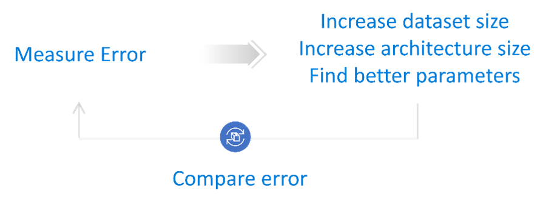
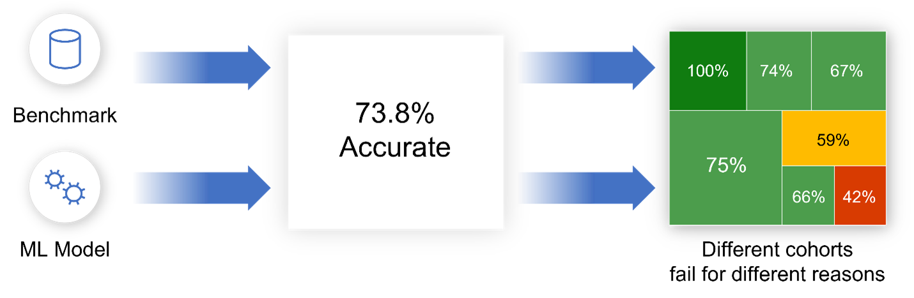

Welcome to RAI Toolbox Mitigations documentation!
=================================================

The Responsible AI Toolbox Mitigations library brings together a set of functionalities that aim to help Machine Learning practitioners and
data scientists in ideating and implementing programmatic steps for mitigating Responsible AI concerns in Machine Learning models. In particular,
the library encourages a targeted approach to mitigation that is informed by previous diagnostic analyses on the model highlighting areas for
which the model performs worse.

Why a targeted approach to RAI mitigations?
-------------------------------------------

Many of the traditional model improvement techniques take a blanket approach aimed at maximizing single-score performance numbers, e.g., overall
model accuracy. Such blanket approaches may increase the size of the training data, the size of the model architecture, or search for better
parameters. There are two issues with these approaches. First, they may not always be feasible for the ML and Data Science teams. Collecting a
much larger dataset or training a much larger model requires expenses or computational resources that are not available for all teams. Second,
even when a blanket approach may be feasible, it may still not be the most cost-effective way of improving the model, especially when the goal of
the mitigation is to improve the model on areas for which it performs worse. For example, if a model trained to predict credit reliability of
customers has a good overall accuracy but performs worse for older citizens because some of their feature data may be missing from records, then
merely adding more data for all citizens will most likely not help with this failure mode.

  Figure 1 - Blanket approaches are often not feasible or cost-effective. They also do not target specific failure modes that the ML/DS team may
  be interested in mitigating.

Since it is common for ML models to perform worse in certain cohorts and the fact that such discrepancies may lead to critical ramifications on the
fairness, reliability, and safety of AI systems, it becomes important for ML/DS teams to be able to address failure modes in a principled and informed
manner.

  Figure 2 – Machine Learning models may perform worse for particular cohorts, which leads to different failure modes. Each failure mode may in turn
  happen for different underlying reasons (e.g. lack of data representation, noise, missing features).

Therefore, the RAI Toolbox Mitigations library offers functionalities that simplify the process of applying known and new mitigations to given failure
modes and cohorts of interest.

.. figure:: imgs/diagnose_mitigate.png
  :scale: 50
  :alt: Diagnose and mitigate

  Figure 3 - The targeted approach to RAI mitigations focuses the mitigation process on previously identified and diagnosed failure modes.

Scope and goals
---------------

The library is built with the following goals in mind:
    * **Convenience and usability:** The library provides a unified interface to mitigation functionalities scattered across several
      well-established packages in the community. As such it brings in the advantage of creating data processing pipelines, without
      worrying about making sure that the output from one mitigation (found in one library) is compatible with the output of a second
      mitigation (found in a separate library). Every mitigation step fits in the .fit() .transform() convention and can be combined
      together in end-to-end mitigation pipelines. Moreover, most function calls are adapted to support the targeted approach to RAI
      mitigations by extending existing calls either with target cohorts or features. As the library grows, we aim to offer a larger and
      more diverse set of mitigations in a simple and easy-to-use programmatic interface.
    * **Education:** There exists no automated silver bullet when it comes to model improvement. As such, the ML/DS practitioner using the
      library remains the main stakeholder deciding which mitigation strategies to apply and deploy for their project. However, thanks to
      longstanding foundational research in Machine Learning there exist several mature algorithms and techniques that can alleviate commonly
      found problems. Our aspiration is to summarize techniques that have stood the test of time and that help in several scenarios. We hope
      that this hub will expose practitioners to commonly used methods and describe to them when and how to use each mitigation step. The best
      way to get started is to go through the notebook tutorials showcasing the benefits and usage of each mitigation.

Note that there exist several other mitigation steps in Responsible AI that are not in the scope of this library. Responsible AI remains a
highly sociotechnical field and development tools or libraries are only one piece of the larger picture. Successful adoption of the library
requires active collaboration with related efforts in sociology, policy, and education. For instance, decisions around whether it is ethically
appropriate to deploy a ML model for a prediction task, changes in the design and user experience, responsible data collection and governance
are all examples of critical mitigation steps that are not in the scope of this library.

Structure
---------

The library has two main modules:

    * **dataprocessing** - A set of data-oriented mitigation steps for data balancing, scaling, missing value imputation, sampling, and encoding.
    * **databalanceanalysis** - A set of metrics for diagnosing and measuring data imbalance. This module is supposed to be used as part of the
      error diagnosis process for failure modes that happen due to class or feature imbalance.

In the future, we plan to integrate more functionalities around data and model-oriented mitigations. Some top-of-mind improvements for the team
include bagging and boosting, better data synthesis, constrained optimizers, handling data noise etc. If you would like to collaborate or contribute
to any of these ideas, feel free to contact us at placeholder@microsoft.com.

Audience
--------

This library was designed to assist Machine Learning and Data Science practitioners as they work on model improvement and Responsible AI mitigations.
Note that while Responsible AI is a broad term that encompasses several aspects (e.g., reliability, robustness, fairness, interpretability, safety,
and privacy), the goal of the library is to encourage and facilitate rigorous ML engineering processes by ideating and implementing improvement steps
in an informed manner. The targeted approach to RAI mitigations prompts a careful thinking mindset that first understands failure modes prior to planning
how to address them.

Related Responsible AI tools
----------------------------

The RAI Toolbox Mitigations library is part of the `Responsible AI Toolbox`_, a larger effort for integrating and building development tools for Responsible AI.
One of the central contributions of the toolbox is the Responsible AI Dashboard, which combines together mature functionalities from relevant tools such as
Error Analysis, Fairlearn, InterpretML, and DiCE. A practitioner using the RAI Toolbox Mitigations library may rely on the dashboard to identify and diagnose
failure modes. Take a look at this technical blog on how to leverage the dashboard for these pre-mitigation steps. At a high level, components in the dashboard
such as Error Analysis and Model Overview help with the identification stage by discovering cohorts of data for which the model underperforms. Other components
like the Data Explorer, Interpretability, and Counterfactual Analysis assist with understanding underlying reasons for why the model is underperforming. These
components go back to the data (Data Explorer) or to the model (Interpretability) to highlight data statistics and feature importances. As the practitioner
investigates the data or the model, they may create hypotheses about how to map the diagnoses to mitigation steps and then implement them through the RAI Toolbox
Mitigations library.

.. _Responsible AI Toolbox: https://responsibleaitoolbox.ai/

From a mitigation perspective, Fairlearn is a closely relevant library in particular for mitigating fairness-related concerns. The set of mitigations in Fairlearn
approach the problem of mitigating model underperformance for given cohorts by framing it as a cost-sensitive classification problem, where samples that satisfy
a particular constraint (similar to the cohort definition) are weighed differently in the optimization process. These mitigations are complementary to the ones
provided here and can be used in combination together.

In addition, we also encourage practitioners to rigorously validate new post-mitigation models and compare them with previous versions to make sure that the
mitigation step indeed improved the model in the way the practitioner expected and that the mitigation step did not lead to new mistakes. To assist with these
steps, BackwardCompatibilityML is a package for an extended support on model comparison and backward compatible training.

Modules
-------

.. toctree::
   :maxdepth: 3

   databalanceanalysis/databalanceanalysis
   dataprocessing/intro

Indices and tables
==================

* :ref:`genindex`
* :ref:`modindex`
